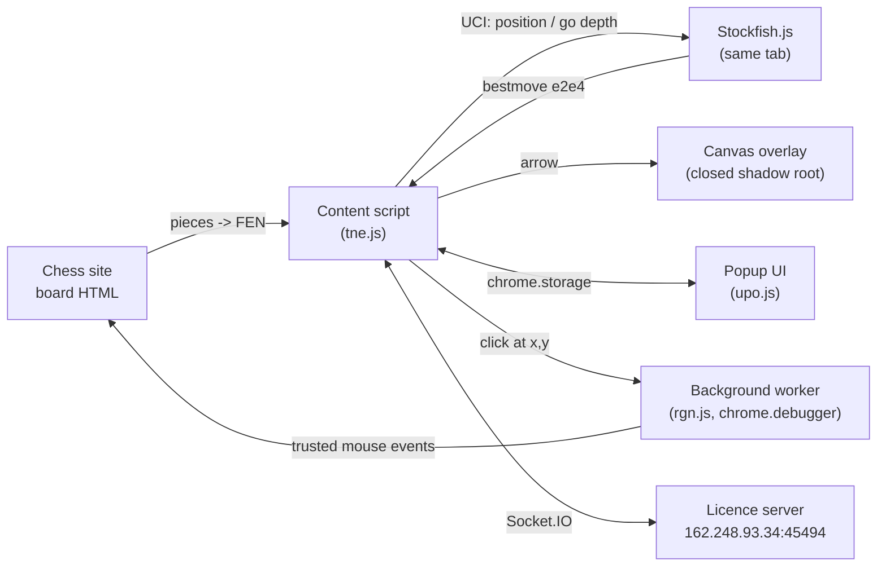

# Chess Assist Teardown

**A reverse-engineering and security-analysis project by [@iostream4YOU](https://github.com/iostream4YOU).**

I took a heavily obfuscated, closed-source Chrome extension that suggests (and auto-plays) chess moves on lichess.org, chess.com, chessarena.com and immortal.game. I wanted to find out exactly how it works.

To get there I built an AST-based deobfuscation pipeline, turned 1.1 MB of one-line obfuscated JavaScript into ~9,800 lines of readable, named and commented code, and wrote up everything I found.

**Main result:** the extension's "ELO" setting is just a search-depth knob on a full-strength Stockfish engine running inside your browser tab. It also depends on a remote server that can switch it off, and it quietly reports your chess username and game URLs to that server.

---

## What I built

| Part | Description |
|---|---|
| **Deobfuscation pipeline** ([`tools/`](tools)) | Two Babel AST passes, fully static, so the target is never executed. It covers constant folding, anti-tamper removal, lookup-table inlining, control-flow restructuring, object-literal reconstruction, and scope-safe renaming driven by JSON maps. One command (`build.sh`) reproduces the output byte for byte. |
| **Rename and annotation maps** ([`tools/maps/`](tools/maps)) | 500+ identifiers named by hand after reading what each one does, plus inline explanations of every important function. |
| **Readable source** (`deobfuscated/`, generated locally) | `build.sh` rebuilds the extension's three scripts in load order with real names and comments. Not redistributed here, since it is derived from proprietary code. |
| **Technical write-up** ([`docs/`](docs)) | 8 documents covering architecture, the move pipeline, the engine settings for each mode, board scraping, overlay and autoplay, the settings bus, the server protocol and privacy, and the obfuscation techniques. |

**Tech:** Node.js, `@babel/parser` / `traverse` / `generator` / `types`, Prettier, the Chrome Extensions MV3 APIs, the UCI chess-engine protocol and the Chrome DevTools Protocol.

---

## Findings

### How a move gets suggested

1. **Scrape the board.** Piece elements are read from the site's HTML (CSS transforms and class names) and turned into a FEN string. No site API is used.
2. **Ask Stockfish locally.** The first 4.8 MB of the content script is Stockfish.js. The extension drives it with standard UCI:
   ```text
   setoption name Skill Level value 20
   position fen <board>
   go depth <N>
   ```
3. **Draw `bestmove`** as an arrow on a canvas over the board. Optionally, **play it** with trusted mouse events through the Chrome DevTools Protocol.

### "ELO" is just search depth

```js
var ELO_LEVELS = [525, 800, 1075, 1350, 1625, 1900, 2175, 2450, 2725, 3000, 3275, 3550];
analysePosition(["11", "1", "20", "0", "1"], fen, eloIndex + 1);   // depth = 1 … 12
//               Contempt MultiPV Skill Error Probability
```

| "ELO" | 525 | 800 | 1075 | 1350 | 1625 | 1900 | 2175 | 2450 | 2725 | 3000 | 3275 | 3550 |
|---|---|---|---|---|---|---|---|---|---|---|---|---|
| **search depth** | 1 | 2 | 3 | 4 | 5 | 6 | 7 | 8 | 9 | 10 | 11 | 12 |

The engine skill is always 20 (full strength). Only "Human" mode (Skill 1–20 with random error) and "Fusion" mode, which reads your opponent's rating from the page and scales to it, actually weaken it. The exact settings for every mode are in [docs/03](docs/03-elo-levels-and-modes.md).

### Security and privacy

- **Remotely controlled.** It's inert until a server at a raw IP (`162.248.93.34:45494`) sends a kill-switch flag and the DOM selectors needed to read lichess and chess.com. Premium features are server flags.
- **Tracking.** After login it reports your **chess-site username** and the **URL of every game** you open.
- **Credentials.** The account password is stored **in plain text** in extension storage.
- **Autoplay** uses the `debugger` permission to send trusted clicks with random delays (33 ms – 24 s).
- **Anti-detection:**
  - the overlay sits inside a **closed shadow root** on a randomly chosen board element;
  - the code is obfuscated with self-defending and console-hijacking guards.
- **Not found:** `eval`, remote code loading, `fetch`, cookie access, or page-storage access.

## Architecture (as reconstructed)



## Write-up

| # | Document | Topic |
|---|---|---|
| 1 | [Architecture](docs/01-architecture.md) | Files, manifest, permissions, how the parts communicate |
| 2 | [How a move is suggested](docs/02-how-a-move-is-suggested.md) | End-to-end pipeline with a worked example |
| 3 | [ELO levels and modes](docs/03-elo-levels-and-modes.md) | Exact Stockfish parameters for every mode |
| 4 | [Reading the board](docs/04-reading-the-board.md) | DOM → FEN on four different sites, and the heuristics' limits |
| 5 | [Overlay, autoplay and extras](docs/05-overlay-autoplay-and-extras.md) | Canvas drawing, CDP clicks, timing, voice, threats, hotkeys |
| 6 | [Popup and settings](docs/06-popup-and-settings.md) | UI and the `chrome.storage` message bus (every key) |
| 7 | [Licence server and privacy](docs/07-licence-server-and-privacy.md) | Socket.IO protocol, kill switch, data sent |
| 8 | [Obfuscation and my deobfuscation approach](docs/08-obfuscation-and-deobfuscation.md) | Techniques used and how I reversed them |

## Run it yourself

```bash
git clone https://github.com/iostream4YOU/chess-assist-analysis.git
cd chess-assist-analysis/tools
npm install
bash build.sh        # needs ../extension/ (see below); writes ../deobfuscated/
```

## Project structure

```text
.
├── tools/                     my deobfuscation pipeline
│   ├── deob.js                pass 1: constant folding, member access, blob extraction
│   ├── readable.js            pass 2: guards, control flow, object literals, renaming, comments
│   ├── maps/*.json            rename + annotation tables
│   └── build.sh               one-command rebuild
├── deobfuscated/              (generated by build.sh, not committed)
│   ├── 01-background.js
│   ├── 02-content-script.js
│   └── 03-popup.js
├── docs/                      technical write-up (01 ... 08)
└── extension/                 (you supply: Chess Assist v28.5, unmodified; not committed)
```

## Credits and licences

The analysed sample is **Chess Assist v28.5** by chessassist.net (proprietary). It is **not included** in this repository, and neither is the readable source derived from it. To reproduce the results, place an unmodified copy of v28.5 in `extension/` and run `tools/build.sh`. It bundles **Stockfish.js** (GPL, nmrugg/stockfish.js) and the **Socket.IO** client (MIT); both licence texts ship inside the extension. My own work (`tools/`, `docs/` and the rename and annotation maps) is under the [MIT License](LICENSE). See [NOTICE.md](NOTICE.md) for details and a note on fair play.
