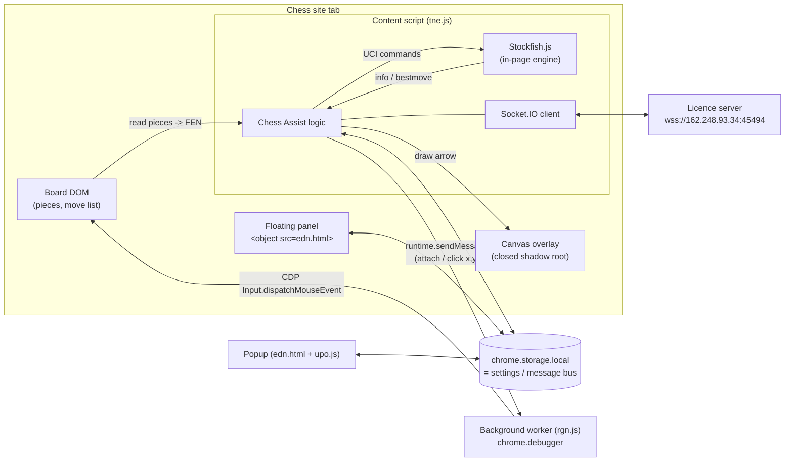

# 1. Architecture and file-by-file breakdown

## The files, in load order

| # | File (original name) | Readable copy | Size | Role |
|---|---|---|---|---|
| 1 | `manifest.json` | (it's plain JSON) | 1 KB | Declares permissions, sites, scripts |
| 2 | `assets/rgn.js` | `01-background.js` (`deobfuscated/01-background.js`) | 2 KB | **Background service worker.** Holds the `debugger` permission and performs trusted mouse clicks for autoplay. |
| 3 | `assets/tne.js` | `02-content-script.js` (`deobfuscated/02-content-script.js`) | 5 MB | **Content script**, injected into every chess tab. Bundles Stockfish.js + Socket.IO + all the logic. |
| 4 | `assets/edn.html` + `assets/upo.js` + `assets/ain.css` | `03-popup.js` (`deobfuscated/03-popup.js`) | 1 MB | **Popup UI** (toolbar button). Also injected into the page as a draggable floating panel. |
| – | `assets/font.ttf`, `assets/*.png` | – | 134 KB | UI font and icons |
| – | `assets/licenses/` | – | – | GPL (Stockfish.js) and MIT (Socket.IO) licence texts |

The file names `rgn`, `tne`, `upo`, `edn`, `ain` are meaningless on purpose.

## `manifest.json`, line by line

```jsonc
{
  "manifest_version": 3,
  "permissions": ["storage", "debugger"],   // storage = settings bus; debugger = CDP access (autoplay clicks)
  "content_scripts": [{
    "matches": ["https://*.lichess.org/*", "https://*.chess.com/*",
                "https://*.chessarena.com/*", "https://*.immortal.game/*"],
    "js": ["./assets/tne.js"]               // the 5 MB bundle, injected into every page of those sites
  }],
  "background": {"service_worker": "./assets/rgn.js"},
  "web_accessible_resources": [{
    "resources": ["assets/edn.html"],       // lets the page embed the popup as a floating panel
    "use_dynamic_url": true                 // randomised URL, so sites can't probe for the extension
  }],
  "action": {"default_popup": "./assets/edn.html"}
}
```

Notable: **there is no `host_permissions` and no `tabs` permission**. The extension can't read your other tabs and doesn't need network permissions for the websocket. `debugger` is the dangerous one: while attached it gives full DevTools-level control of the tab, and Chrome shows a yellow "Chess Assist started debugging this browser" bar.

## Inside `tne.js` (the content-script bundle)

| Lines | Content | Licence |
|---|---|---|
| 1–19 | **Stockfish.js** (nmrugg), an asm.js build of the Stockfish chess engine exposing `STOCKFISH()` | GPL |
| 21–26 | **Socket.IO client 4.7.2**, exposing `io` | MIT |
| 28–31 | **Chess Assist** itself: 124 KB, one obfuscated line, wrapped in `function P(){...} P();` | proprietary |

`upo.js` (popup) is one obfuscated line, and 90% of it is 68 base64 PNGs and 2 MP3 click sounds.

## How the three parts communicate



- **Popup ↔ content script** never message each other directly. Both read and write `chrome.storage.local` and react to `chrome.storage.onChanged`. Storage is effectively a pub/sub bus. Every key is listed in [06-popup-and-settings.md](06-popup-and-settings.md).
- **Content script → background** uses `chrome.runtime.sendMessage` with three message types: attach debugger, detach debugger, and mouse press/release at (x, y).
- **Content script ↔ server** uses Socket.IO over a websocket. It carries licensing, remote enable/disable, DOM selectors and account actions. See [07-licence-server-and-privacy.md](07-licence-server-and-privacy.md).

## The background worker in full

It's short enough to summarise completely (`01-background.js` (`deobfuscated/01-background.js`)):

| Message from content script | What the worker does |
|---|---|
| `"lga-datas-atch"` | `chrome.debugger.attach({tabId}, "1.3")` on the sender's tab |
| `"lga-datas-dtch"` | For every attached page target: `chrome.debugger.detach` |
| `{val0: "lga-datas-snmd", val1: "p", val2: x, val3: y}` | `Input.dispatchMouseEvent {type: "mousePressed", x, y, button: "left", clickCount: 1}` |
| `{val0: "lga-datas-snmd", val1: "r", val2: x, val3: y}` | same with `mouseReleased` |
| (event) `chrome.debugger.onDetach` | sets `function_atpl = false`, so autoplay is switched off |

Events produced this way are real browser input with `isTrusted === true`, which a page can't tell apart from a physical mouse.

## Lifecycle of the content script

1. Loads on every matching page and immediately sends `"lga-datas-dtch"` to release any leftover debugger session.
2. Reads saved settings from storage and resets the display keys to `"..."`.
3. Every 500 ms it checks whether the URL changed. On a change it runs `resetForNewPage()` → `startSiteDetection()`. The sites are single-page apps, so a new game doesn't reload the script.
4. On a playable game page: `connectToServer()`. After the server enables it, it runs the per-site loop described in [02-how-a-move-is-suggested.md](02-how-a-move-is-suggested.md).
