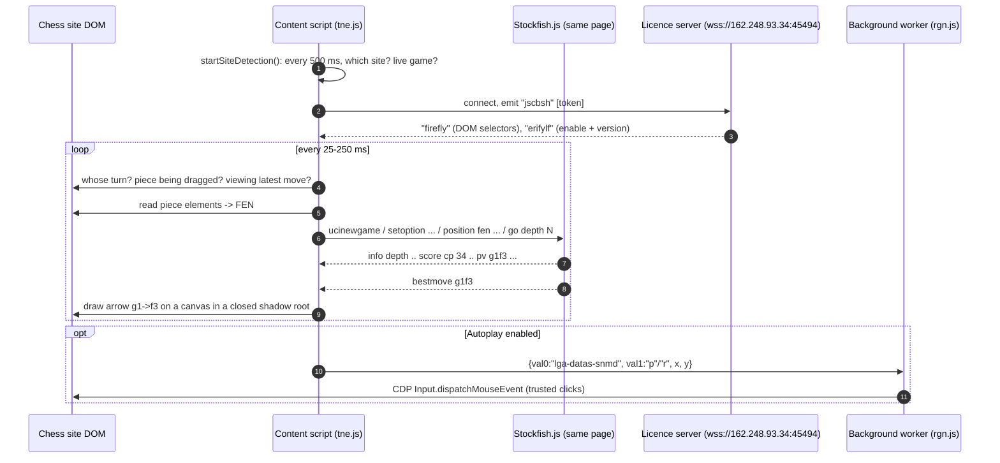

# 2. How a move is suggested, step by step

This is the heart of the extension. Short version: **it reads the board out of the page's HTML and turns it into a FEN string. It hands that FEN to a copy of Stockfish running inside the page, with settings derived from your "ELO" and mode. Then it draws Stockfish's `bestmove` as an arrow.**

All code links point at the readable copy, `deobfuscated/02-content-script.js` (`deobfuscated/02-content-script.js`).



## Worked example: lichess, playing White, ENGINE mode, "1900 ELO"

### Step 0: the extension switches itself on (only if the server allows it)

1. `startSiteDetection()` (`deobfuscated/02-content-script.js`, line 136) runs on a 500 ms interval. It sees `lichess.org` in the URL (site code `"periwinkle"`). It also sees that the page has a `.round` element but no `.analyse` element, and that the title contains none of "puzzle", "spectator" or "editor". Variant games (KOTH, Three-check, Antichess, Atomic, Racing Kings) are skipped.
2. It calls `connectToServer("periwinkle")` (`deobfuscated/02-content-script.js`, line 963), which opens a Socket.IO websocket to `wss://162.248.93.34:45494`.
3. The server replies with:
   - `firefly`: the CSS/tag names needed to read lichess (for example the tag used for moves in the move list). This sets `selectorsReady = true`.
   - `erifylf`: a base64 flag. `"dg6"` means enabled and `"85b"` means disabled. This is a **remote kill switch** (`applyKillSwitch` (`deobfuscated/02-content-script.js`, line 1327)). Then `engineGate = 3` is set and `loopLichess()` starts.

Without these server messages, every stage below returns early. See [07-licence-server-and-privacy.md](07-licence-server-and-privacy.md).

### Step 1: decide whether it's our turn

`loopLichess()` (`deobfuscated/02-content-script.js`, line 4781) polls the page:

| Check | How |
|---|---|
| Is it my move? `isMyTurnLichess` (`deobfuscated/02-content-script.js`, line 4509) | Count the entries in the move list. An even count means White to move. Compare that with the board orientation: the `<coords>` element has class `black` when you play Black. |
| Is the board settled? `isBoardSettledLichess` (`deobfuscated/02-content-script.js`, line 4536) | No `.anim` element (no piece mid-animation). The last move in the list is the *active* one, so you're not browsing old moves. |
| Is the game still running? | No `.outoftime` or `.rematch` element, no "New opponent" button, and no piece being dragged. |

The result is a **turn state** passed to `onTurnState(state)` (`deobfuscated/02-content-script.js`, line 3067):
`0` = my move, `1` = opponent's move, `2` = game over, `3` = idle, `4` = puzzle (chess.com only).

### Step 2: read the board and build a FEN

For state 0 or 1, `onTurnState` reads the pieces for the current site (details for all four sites are in [04-reading-the-board.md](04-reading-the-board.md)). On lichess:

```text
<cg-board>
  <piece class="white knight" style="transform: translate(360px, 420px)">
  ...
```

- `squareSize = board.width / 8`, and the offsets are `[0, s, 2s, ... 7s]`.
- Each piece's `translate(x, y)` is matched to a file/rank. The class name becomes a FEN letter: `white knight` → `N`, `black pawn` → `p`.
- Empty squares are counted into digits, and ranks are joined with `/`.
- If you're Black, the board is drawn upside down, so the finished placement string is **reversed character by character**. That is exactly a 180° rotation.
- `" w"` or `" b"` is appended, from the move-count parity.

Result, for example: `rnbqkbnr/pppp1ppp/8/4p3/4P3/8/PPPP1PPP/RNBQKBNR w`

### Step 3: finish the FEN and choose engine settings

`completeFenAndAnalyse(fen)` (`deobfuscated/02-content-script.js`, line 1472) does three things:

1. **Castling rights**: it starts from `KQkq` and scans the move list. A king move or `O-O` removes both rights for that side. A rook move whose text starts with `Rf/Rg/Rh` removes the king-side right, and `Ra…Rd` removes the queen-side right. In puzzles it infers rights from where the king and rooks stand.
2. **En passant**: it always appends `" -"`. The engine is never told an en-passant capture is available, which is a limitation of the extension.
3. **Engine settings**: it picks from the mode and ELO. For ENGINE mode at "1900 ELO" (`eloIndex = 5`):
   ```js
   analysePosition(["11", "1", "20", "0", "1"], fen, eloIndex + 1)   // depth 6
   ```
   The five values are `[Contempt, MultiPV, Skill Level, Skill Level Maximum Error, Skill Level Probability]`. All modes are tabulated in [03-elo-levels-and-modes.md](03-elo-levels-and-modes.md).

### Step 4: talk UCI to Stockfish

`analysePosition()` (`deobfuscated/02-content-script.js`, line 1423) sends:

```text
ucinewgame
setoption name Contempt value 11
setoption name MultiPV value 1
setoption name Skill Level value 20
setoption name Skill Level Maximum Error value 0
setoption name Skill Level Probability value 1
setoption name Move Overhead value 0
setoption name Minimum Thinking Time value 0
setoption name Slow Mover value 10
position fen rnbqkbnr/pppp1ppp/8/4p3/4P3/8/PPPP1PPP/RNBQKBNR w KQkq -
go depth 6
```

The engine is `STOCKFISH()` from **Stockfish.js by nmrugg** (GPL). It's bundled as the first ~4.8 MB of `tne.js`, so no chess engine runs on any server. The server is only a licence and control channel.

Other engine commands are used at times:
- `d` makes this Stockfish build print `Legal uci moves: ...`, which is used for threats and fun modes.
- `eval` prints the classical evaluation table, which is shown in the popup.

### Step 5: parse the engine's answer

`engine.onmessage` (`deobfuscated/02-content-script.js`, line 3750) receives one line at a time:

```text
info depth 6 seldepth 8 multipv 1 score cp 34 nodes 5230 ... pv g1f3 b8c6 f1b5 ...
bestmove g1f3 ponder b8c6
```

- `score cp 34` → `bestScore = 34`, or `score mate 3` → mate score.
- `bestmove g1f3` → `bestMove = "g1f3"`, then `handleBestMove()`.
- Every line pushes the next `loopLichess()` run back to 25 ms later. Analysis therefore restarts as soon as the engine goes quiet, which makes it a continuous loop.

### Step 6: show it

`handleBestMove()` (`deobfuscated/02-content-script.js`, line 3678):

1. Clears and redraws if the window size, square size or scroll position changed.
2. `publishBestMove()` (`deobfuscated/02-content-script.js`, line 3510) writes `nEw_mv_value = "g1f3"` and `nEw_sc_value = "+0.34"` to `chrome.storage.local`. The score sign is flipped to your side's perspective. The popup shows these values.
3. Splits `"g1f3"` into `["g","1","f","3"]`. `moveToPixels()` (`deobfuscated/02-content-script.js`, line 2000) then turns each file letter and rank digit into a pixel offset, mirrored if the board is flipped.
4. `drawOverlay()` (`deobfuscated/02-content-script.js`, line 2355) creates a `<canvas>` exactly the size of the board and puts it on top with `position: fixed`. It draws an arrow from the centre of g1 to the centre of f3 (`drawArrow` (`deobfuscated/02-content-script.js`, line 2426)). The canvas lives in a closed shadow root. The colour depends on the mode (ENGINE = dark red `rgb(128,0,0)`).

The drawn move is remembered in `drawnArrows`, so the same arrow isn't drawn twice. When the position changes, `detectPositionChange()` (`deobfuscated/02-content-script.js`, line 2876) clears the canvas. It then blocks analysis for 100 ms (250 ms on lichess) so the site's move animation can finish.

### Step 7: the opponent's turn

When `onTurnState(1)` fires, the same pipeline predicts **the opponent's** best reply: `[66, 1, 20, 0, 1]` at a fixed depth 8. It's drawn as an orange arrow `rgb(204,85,0)`, but only if "show opponent move" (`trafl_value`) is on.

### Step 8 (optional): autoplay

If autoplay is on, the content script sends mouse coordinates to the background worker. The worker clicks the from-square and then the to-square through the Chrome DevTools Protocol. See [05-overlay-autoplay-and-extras.md](05-overlay-autoplay-and-extras.md#autoplay).
